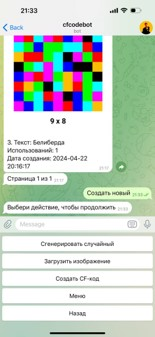
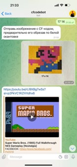
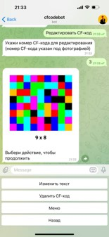

# cfcodes

<div>
    
    
    
    
    
</div>

Watch demo video

# About the project

My old school project. The main idea was to make ordinary qr codes colourful, because they are everywhere but despite this qr codes are black and white, that make them look awful and very sad. So there it is colourful qr codes - cf codes. I think that I've done pretty good work and the project isn't bad at all but jury didn't appreciate it very well. I think that they just didn't understand the main idea and was too old for it. I am not shaming them for their age but I think, that persons, who can't handle even a qr code, can't evaluate my idea right. Of course it's only demo and not a final product, but it's funny. I think if the project would have been done by some professional it will have great success. The project has full documentation in russian language. I've used telegram bot because it was the most easiest way to interact with the cf codes because I couldn't do an app. And I've used sqlite3 instead of postgresql because I didn't have enough knowledge also it was my first time using opencv. Despite all that, for me the project is very interesting. Pixeled photos was awesome.

I've shown my project in many different conferences:
- Юные дарования 21 века
  - [1st place](https://ibb.co/qLzhHwpX)
- Наука. Смелость. Изобретения
  - [3rd place](https://ibb.co/KpxkFw5s) 
- Взлет
  - [Laureate](https://ibb.co/sd06CWfX)
- Большие вызовы

# Main functions

- Create cf code
- Create cf code from image
- Read cf code

# Used in project

- Python 3.8+
- Aiogram - for operating the telegram bot
- Sqlite3 - for operating the database
- Opencv - for computer vision
- Pillow - for creating images

# Downloading and running the bot

### 1. Download [Python](https://www.python.org/) and IDE

You can use any IDE you want, for example: PyCharm, VSCode, Python IDLE, etc.

### 2. Download ZIP or use git clone

```bash
git clone https://github.com/middelmatigheid/cfcodes.git
cd cfcodes
```

### 3. Create virtual environment

If you are using Linux/MacOS

```bash
python -m venv venv
source venv/bin/activate
```

If you are using Windows

```bash
python -m venv venv
venv\Scripts\activate 
```

### 4. Install requirements

```bash
pip install -r requirements.txt
```

### 5. Create a telegram bot

Create a telegram bot using [@BotFather](https://telegram.me/BotFather), add payment method

### 6. Create .env file

Create .env file in the main directory and set up the values

```bash
BOT_TOKEN='YOUR BOT TOKEN'
```

### 7. Run the bot

```bash
python tgbot.py
```

# Project structure

```bash
cfcodes/
├── tgbot.py               # Main file to run the bot
├── cfcode.py              # File for reading and creating cf codes
├── database.py            # File for operating the database
├── documentation          # All documentation                 
├── Roboto-Bold.ttf        # Font
├── requirements.txt       # Python requirements
└── .env                   # Environment variables
```


